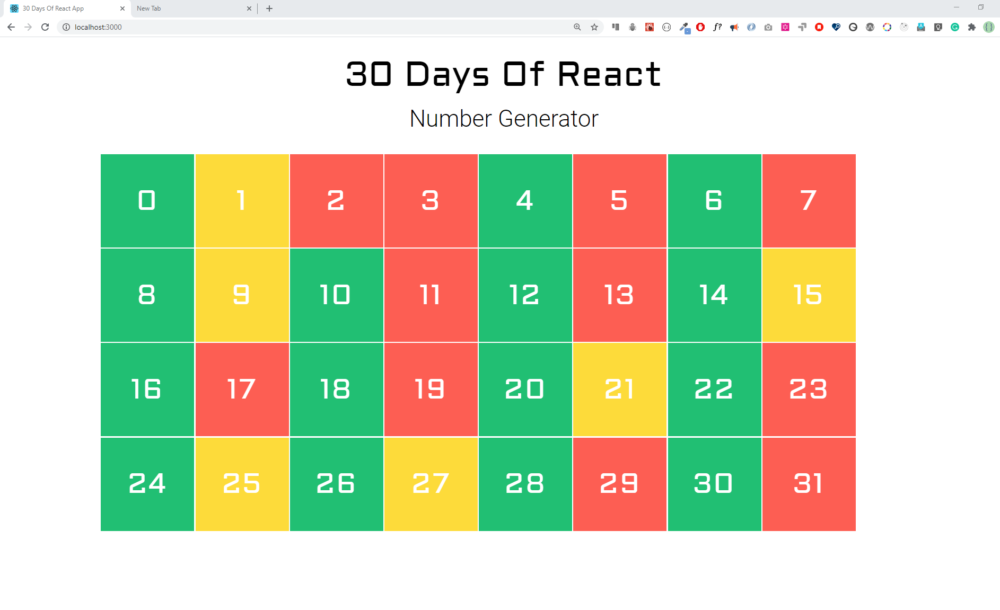
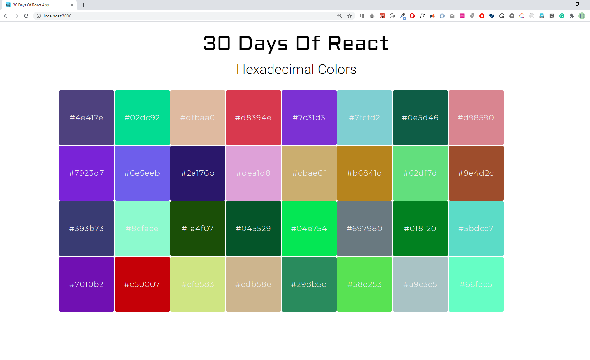
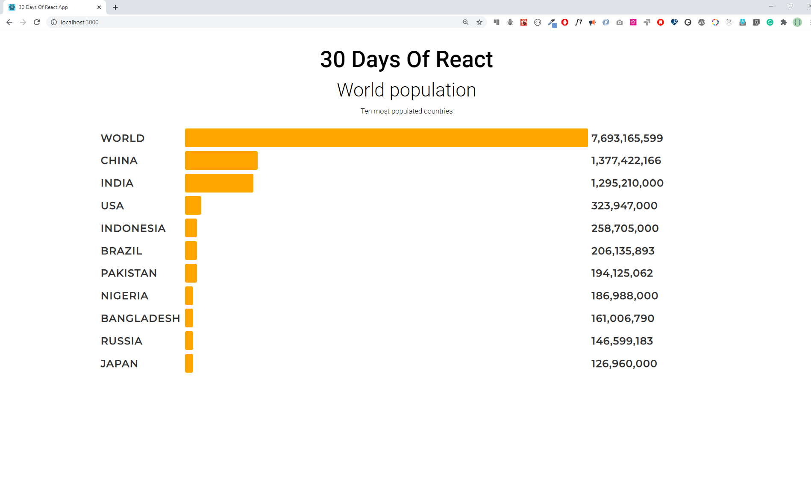

<div align="center">
  <h1> 30 Days Of React: Mapping Arrays </h1>
  <a class="header-badge" target="_blank" href="https://www.linkedin.com/in/asabeneh/">
  
  </a>
  <a class="header-badge" target="_blank" href="https://twitter.com/Asabeneh">
  
  </a>

<sub>Author:
<a href="https://www.linkedin.com/in/asabeneh/" target="_blank">Asabeneh Yetayeh</a><br>
<small> October, 2020</small>
</sub>

</div>

[<< Day 5](./../05_Day_Props/05_props.md) | [Day 7 >>](../07_Day_Class_Components/07_class_components.md)


- [Mapping arrays](#mapping-arrays)
  - [Mapping and rendering arrays](#mapping-and-rendering-arrays)
    - [Mapping array of numbers](#mapping-array-of-numbers)
    - [Mapping array of arrays](#mapping-array-of-arrays)
    - [Mapping array of objects](#mapping-array-of-objects)
    - [Key in mapping arrays](#key-in-mapping-arrays)
- [Exercises](#exercises)
  - [Exercises: Level 1](#exercises-level-1)
  - [Exercises: Level 2](#exercises-level-2)
  - [Exercises: Level 3](#exercises-level-3)

# Mapping arrays
Một mảng là cấu trúc dữ liệu được sử dụng phổ biến nhất để giải quyết nhiều loại vấn đề. Trong React, chúng ta sử dụng map để sửa đổi một mảng thành danh sách các JSX bằng cách thêm các phần tử HTML nhất định vào mỗi phần tử của mảng.
## Mapping and rendering arrays
Thường thì dữ liệu có dạng mảng hoặc mảng đối tượng. Để hiển thị mảng hoặc mảng đối tượng này, chúng ta thường xuyên sử dụng phương thức _map_. Trong phần trước, chúng ta đã hiển thị danh sách techs bằng phương thức map. Trong phần này, chúng ta sẽ xem thêm nhiều ví dụ.

Trong các ví dụ sau, bạn sẽ thấy cách hiển thị mảng số, mảng chuỗi, mảng quốc gia và mảng kỹ năng trên trình duyệt.
```js
import React from 'react'
import ReactDOM from 'react-dom'
const App = () => {
  return (
    <div className='container'>
      <div>
        <h1>Numbers List</h1>
        {[1, 2, 3, 4, 5]}
      </div>
    </div>
  )
}

const rootElement = document.getElementById('root')
ReactDOM.render(<App />, rootElement)
```
Nếu bạn kiểm tra trình duyệt, bạn sẽ thấy các số được dính liền thành một dòng. Để tránh điều này, chúng ta sửa đổi mảng và thay đổi các phần tử của mảng thành các phần tử JSX. Xem ví dụ bên dưới, mảng đã được sửa đổi thành một danh sách các phần tử JSX.
### Mapping array of numbers


```js
import React from 'react'
import ReactDOM from 'react-dom'

const Numbers = ({ numbers }) => {
  // modifying array to array of li JSX
  const list = numbers.map((number) => <li>{number}</li>)
  return list
}

// App component

const App = () => {
  const numbers = [1, 2, 3, 4, 5]

  return (
    <div className='container'>
      <div>
        <h1>Numbers List</h1>
        <ul>
          <Numbers numbers={numbers} />
        </ul>
      </div>
    </div>
  )
}

const rootElement = document.getElementById('root')
ReactDOM.render(<App />, rootElement)
```


### Mapping array of arrays
Let's see how to map array of arrays
```js
import React from 'react'
import ReactDOM from 'react-dom'

const skills = [
  ['HTML', 10],
  ['CSS', 7],
  ['JavaScript', 9],
  ['React', 8],
]

// Skill Component
const Skill = ({ skill: [tech, level] }) => (
  <li>
    {tech} {level}
  </li>
)

// Skills Component
const Skills = ({ skills }) => {
  const skillsList = skills.map((skill) => <Skill skill={skill} />)
  console.log(skillsList)
  return <ul>{skillsList}</ul>
}

const App = () => {
  return (
    <div className='container'>
      <div>
        <h1>Skills Level</h1>
        <Skills skills={skills} />
      </div>
    </div>
  )
}

const rootElement = document.getElementById('root')
ReactDOM.render(<App />, rootElement)
```


### Mapping array of objects
Rendering array of objects
```js
import React from 'react'
import ReactDOM from 'react-dom'

const countries = [
  { name: 'Finland', city: 'Helsinki' },
  { name: 'Sweden', city: 'Stockholm' },
  { name: 'Denmark', city: 'Copenhagen' },
  { name: 'Norway', city: 'Oslo' },
  { name: 'Iceland', city: 'Reykjavík' },
]

// Country component
const Country = ({ country: { name, city } }) => {
  return (
    <div>
      <h1>{name}</h1>
      <small>{city}</small>
    </div>
  )
}

// countries component
const Countries = ({ countries }) => {
  const countryList = countries.map((country) => <Country country={country} />)
  return <div>{countryList}</div>
}
// App component
const App = () => (
  <div className='container'>
    <div>
      <h1>Countries List</h1>
      <Countries countries={countries} />
    </div>
  </div>
)

const rootElement = document.getElementById('root')
ReactDOM.render(<App />, rootElement)
```


### Key in mapping arrays
Các khóa giúp React xác định các mục đã thay đổi, được thêm vào hoặc xóa. Các khóa nên được cung cấp cho các phần tử bên trong mảng để cung cấp cho các phần tử một bản danh tính ổn định. Khóa phải là duy nhất. Thông thường dữ liệu sẽ đi kèm với một ID và chúng ta có thể sử dụng ID làm khóa. Nếu chúng ta không truyền khóa cho React trong quá trình ánh xạ, nó sẽ đưa ra cảnh báo trên trình duyệt. Nếu dữ liệu không có ID, chúng ta phải tìm cách tạo một định danh duy nhất cho mỗi phần tử khi ánh xạ. Xem ví dụ sau:
```js
import React from 'react'
import ReactDOM from 'react-dom'

const Numbers = ({ numbers }) => {
  // modifying array to array of li JSX
  const list = numbers.map((num) => <li key={num}>{num}</li>)
  return list
}

const App = () => {
  const numbers = [1, 2, 3, 4, 5]

  return (
    <div className='container'>
      <div>
        <h1>Numbers List</h1>
        <ul>
          <Numbers numbers={numbers} />
        </ul>
      </div>
    </div>
  )
}

const rootElement = document.getElementById('root')
ReactDOM.render(<App />, rootElement)
```
Hãy cũng thêm ví dụ về bản đồ các quốc gia chính nhé.
```js
import React from 'react'
import ReactDOM from 'react-dom'

const countries = [
  { name: 'Finland', city: 'Helsinki' },
  { name: 'Sweden', city: 'Stockholm' },
  { name: 'Denmark', city: 'Copenhagen' },
  { name: 'Norway', city: 'Oslo' },
  { name: 'Iceland', city: 'Reykjavík' },
]

// Country component
const Country = ({ country: { name, city } }) => {
  return (
    <div>
      <h1>{name}</h1>
      <small>{city}</small>
    </div>
  )
}

// countries component
const Countries = ({ countries }) => {
  const countryList = countries.map((country) => (
    <Country key={country.name} country={country} />
  ))
  return <div>{countryList}</div>
}
const App = () => (
  <div className='container'>
    <div>
      <h1>Countries List</h1>
      <Countries countries={countries} />
    </div>
  </div>
)

const rootElement = document.getElementById('root')
ReactDOM.render(<App />, rootElement)
```


# Exercises

## Exercises: Level 1

1. Why you need to map an array ?
2. Why we need keys during mapping an array ?
3. What is the importance of destructuring your code ?
4. Does destructuring make your code clean and easy to read ?

## Exercises: Level 2

1. In the following design, evens are green, odds are yellow and prime numbers are red. Build the following colors using React component



2. Create the following hexadecimal colors using React component



## Exercises: Level 3

1.Make the following bar group using the given [data](../06_Day_Map_List_Keys/06_map_list_keys_boilerplate/src/data/ten_most_highest_populations.js)



🎉 CONGRATULATIONS ! 🎉

[<< Day 5](./../05_Day_Props/05_props.md) | [Day 7 >>](../07_Day_Class_Components/07_class_components.md)
