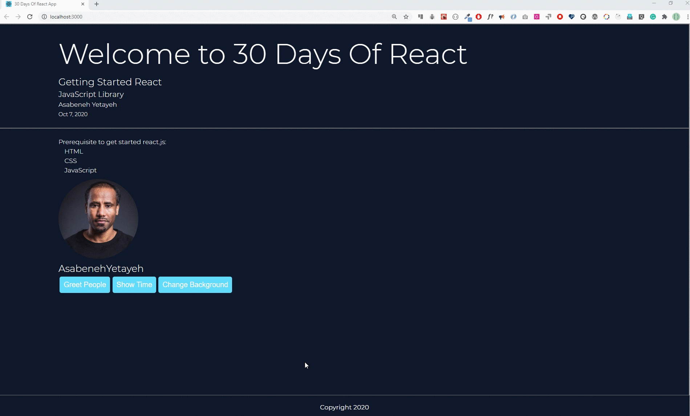
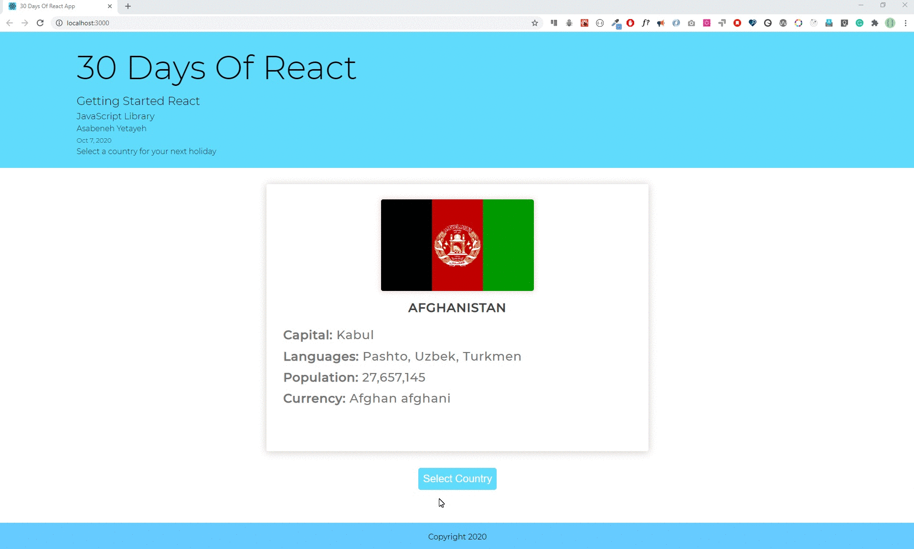

<div align="center">
  <h1> 30 Days Of React: States</h1>
  <a class="header-badge" target="_blank" href="https://www.linkedin.com/in/asabeneh/">
  
  </a>
  <a class="header-badge" target="_blank" href="https://twitter.com/Asabeneh">
  
  </a>

<sub>Author:
<a href="https://www.linkedin.com/in/asabeneh/" target="_blank">Asabeneh Yetayeh</a><br>
<small> October, 2020</small>
</sub>

</div>

[<< Day 7](../07_Day_Class_Components/07_class_components.md) | [Day 9 >>](../09_Day_Conditional_Rendering/09_conditional_rendering.md)


- [States](#states)
  - [What is State?](#what-is-state)
  - [How to set a state](#how-to-set-a-state)
  - [Resetting a state using a JavaScript method](#resetting-a-state-using-a-javascript-method)
  - [Exercises](#exercises)
    - [Exercises: Level 1](#exercises-level-1)
    - [Exercises: Level 2](#exercises-level-2)
    - [Exercises: Level 3](#exercises-level-3)

# States


## What is State?
What là state? Ý nghĩa tiếng Anh của state là _tình trạng cụ thể mà ai đó hoặc cái gì đó đang ở vào vào một thời điểm nhất định_.

Hãy cùng xem state có thể là điều gì - Bạn có vui không hay buồn? - Ánh sáng có đang bật hay tắt? Hiện diện có hoặc không? - Đầy hay trống? Ví dụ, tôi cảm thấy vui vì tôi đang tận hưởng thử thách 30 Days Of React. Tôi tin rằng bạn cũng cảm thấy vui.

State là một đối tượng trong react cho phép thành phần lại render khi dữ liệu state thay đổi.
## How to set a state
Chúng ta thiết lập trạng thái ban đầu bên trong bộ phận khởi tạo hoặc bên ngoài bộ phận khởi tạo của một lớp thành phần dựa trên component. Chúng ta không thay đổi hoặc sửa đổi trực tiếp trạng thái mà chúng ta sử dụng phương thức _setState()_ để trả về trạng thái mới. Như bạn thấy trong đối tượng trạng thái, chúng ta có count với giá trị ban đầu là 0. Chúng ta có thể truy cập đối tượng trạng thái bằng _this.state_ và tên thuộc tính. Xem ví dụ bên dưới.
```js
// index.js
import React from 'react'
import ReactDOM from 'react-dom'

class App extends React.Component {
  // declaring state
  state = {
    count: 0,
  }
  render() {
    // accessing the state value
    const count = this.state.count
    return (
      <div className='App'>
        <h1>{count} </h1>
      </div>
    )
  }
}
const rootElement = document.getElementById('root')
ReactDOM.render(<App />, rootElement)
```
Nếu bạn chạy mã trên, bạn sẽ thấy số không trên trình duyệt. Chúng ta có thể tăng hoặc giảm giá trị trạng thái bằng cách thay đổi giá trị trạng thái bằng phương thức JavaScript.
## Resetting a state using a JavaScript method
Bây giờ, hãy thêm các phương thức để tăng hoặc giảm giá trị của count bằng cách nhấp vào nút. Chúng ta hãy thêm một nút tăng và một nút giảm giá trị của count. Để đặt trạng thái, chúng ta sử dụng phương thức `_this.setState_`. Xem ví dụ bên dưới.
```js
// index.js
import React from 'react'
import ReactDOM from 'react-dom'
class App extends React.Component {
  // declaring state
  state = {
    count: 0,
  }
  render() {
    // accessing the state value
    const count = this.state.count
    return (
      <div className='App'>
        <h1>{count} </h1>
        <button onClick={() => this.setState({ count: this.state.count + 1 })}>
          Add One
        </button>
      </div>
    )
  }
}
const rootElement = document.getElementById('root')
ReactDOM.render(<App />, rootElement)
```
If you understand the above example, adding minus one method will be easy. Let us add the minus one method on the click event.
```js
// index.js
import React from 'react'
import ReactDOM from 'react-dom'
class App extends React.Component {
  // declaring state
  state = {
    count: 0,
  }
  render() {
    // accessing the state value
    const count = this.state.count
    return (
      <div className='App'>
        <h1>{count} </h1>

        <div>
          <button
            onClick={() => this.setState({ count: this.state.count + 1 })}
          >
            Add One
          </button>{' '}
          <button
            onClick={() => this.setState({ count: this.state.count - 1 })}
          >
            Minus One
          </button>
        </div>
      </div>
    )
  }
}
const rootElement = document.getElementById('root')
ReactDOM.render(<App />, rootElement)
```
Cả hai nút đều hoạt động tốt, nhưng chúng ta cần tái cấu trúc mã một cách tốt hơn. Hãy tạo các phương thức riêng biệt trong thành phần.
```js
// index.js
import React from 'react'
import ReactDOM from 'react-dom'
class App extends React.Component {
  // declaring state
  state = {
    count: 0,
  }
  // method which add one to the state

  addOne = () => {
    this.setState({ count: this.state.count + 1 })
  }

  // method which subtract one to the state
  minusOne = () => {
    this.setState({ count: this.state.count - 1 })
  }
  render() {
    // accessing the state value
    const count = this.state.count
    return (
      <div className='App'>
        <h1>{count} </h1>

        <div>
          <button className='btn btn-add' onClick={this.addOne}>
            +1
          </button>{' '}
          <button className='btn btn-minus' onClick={this.minusOne}>
            -1
          </button>
        </div>
      </div>
    )
  }
}
const rootElement = document.getElementById('root')
ReactDOM.render(<App />, rootElement)
```
Hãy cùng làm thêm nhiều ví dụ hơn về trạng thái, trong ví dụ này chúng ta sẽ phát triển một ứng dụng nhỏ hiển thị chó hoặc mèo. Chúng ta có thể bắt đầu bằng cách đặt trạng thái ban đầu là mèo và khi nhấp vào nó sẽ hiển thị chó và ngược lại. Chúng ta cần một phương thức duy nhất để thay đổi động vật một cách xen kẽ. Xem mã bên dưới. Nếu bạn muốn xem nhấp trực tiếp [ở đây](
https://codepen.io/Asabeneh/full/LYVxKpq).


```js
// index.js
import React from 'react'
import ReactDOM from 'react-dom'
class App extends React.Component {
  // declaring state
  state = {
    image: 'https://www.smithsstationah.com/imagebank/eVetSites/Feline/01.jpg',
  }
  changeAnimal = () => {
    let dogURL =
      'https://static.onecms.io/wp-content/uploads/sites/12/2015/04/dogs-pembroke-welsh-corgi-400x400.jpg'
    let catURL =
      'https://www.smithsstationah.com/imagebank/eVetSites/Feline/01.jpg'
    let image = this.state.image === catURL ? dogURL : catURL
    this.setState({ image })
  }

  render() {
    // accessing the state value
    const count = this.state.count
    return (
      <div className='App'>
        <h1>30 Days Of React</h1>
        <div className='animal'>
          
        </div>

        <button onClick={this.changeAnimal} class='btn btn-add'>
          Change
        </button>
      </div>
    )
  }
}
const rootElement = document.getElementById('root')
ReactDOM.render(<App />, rootElement)
```
Bây giờ, hãy đưa tất cả các mã chúng ta đã có và cũng hãy thực hiện trạng thái khi cần thiết.
```js
// index.js
import React from 'react'
import ReactDOM from 'react-dom'
import asabenehImage from './images/asabeneh.jpg'

// Fuction to show month date year

const showDate = (time) => {
  const months = [
    'January',
    'February',
    'March',
    'April',
    'May',
    'June',
    'July',
    'August',
    'September',
    'October',
    'November',
    'December',
  ]

  const month = months[time.getMonth()].slice(0, 3)
  const year = time.getFullYear()
  const date = time.getDate()
  return ` ${month} ${date}, ${year}`
}

// User Card Component
const UserCard = ({ user: { firstName, lastName, image } }) => (
  <div className='user-card'>
    
    <h2>
      {firstName}
      {lastName}
    </h2>
  </div>
)

// A button component
const Button = ({ text, onClick, style }) => (
  <button style={style} onClick={onClick}>
    {text}
  </button>
)

// CSS styles in JavaScript Object
const buttonStyles = {
  backgroundColor: '#61dbfb',
  padding: 10,
  border: 'none',
  borderRadius: 5,
  margin: 3,
  cursor: 'pointer',
  fontSize: 18,
  color: 'white',
}

// class based component
class Header extends React.Component {
  constructor(props) {
    super(props)
    // the code inside the constructor run before any other code
  }
  render() {
    console.log(this.props.data)
    const {
      welcome,
      title,
      subtitle,
      author: { firstName, lastName },
      date,
    } = this.props.data

    return (
      <header style={this.props.styles}>
        <div className='header-wrapper'>
          <h1>{welcome}</h1>
          <h2>{title}</h2>
          <h3>{subtitle}</h3>
          <p>
            {firstName} {lastName}
          </p>
          <small>{date}</small>
        </div>
      </header>
    )
  }
}

const Count = ({ count, addOne, minusOne }) => (
  <div>
    <h1>{count} </h1>
    <div>
      <Button text='+1' onClick={addOne} style={buttonStyles} />
      <Button text='-1' onClick={minusOne} style={buttonStyles} />
    </div>
  </div>
)

// TechList Component
// class base component
class TechList extends React.Component {
  constructor(props) {
    super(props)
  }
  render() {
    const { techs } = this.props
    const techsFormatted = techs.map((tech) => <li key={tech}>{tech}</li>)
    return techsFormatted
  }
}

// Main Component
// Class Component
class Main extends React.Component {
  constructor(props) {
    super(props)
  }
  render() {
    const {
      techs,
      user,
      greetPeople,
      handleTime,
      changeBackground,
      count,
      addOne,
      minusOne,
    } = this.props
    return (
      <main>
        <div className='main-wrapper'>
          <p>Prerequisite to get started react.js:</p>
          <ul>
            <TechList techs={techs} />
          </ul>
          <UserCard user={user} />
          <Button
            text='Greet People'
            onClick={greetPeople}
            style={buttonStyles}
          />
          <Button text='Show Time' onClick={handleTime} style={buttonStyles} />
          <Button
            text='Change Background'
            onClick={changeBackground}
            style={buttonStyles}
          />
          <Count count={count} addOne={addOne} minusOne={minusOne} />
        </div>
      </main>
    )
  }
}

// Footer Component
// Class component
class Footer extends React.Component {
  constructor(props) {
    super(props)
  }
  render() {
    return (
      <footer>
        <div className='footer-wrapper'>
          <p>Copyright {this.props.date.getFullYear()}</p>
        </div>
      </footer>
    )
  }
}

class App extends React.Component {
  state = {
    count: 0,
    styles: {
      backgroundColor: '',
      color: '',
    },
  }
  showDate = (time) => {
    const months = [
      'January',
      'February',
      'March',
      'April',
      'May',
      'June',
      'July',
      'August',
      'September',
      'October',
      'November',
      'December',
    ]

    const month = months[time.getMonth()].slice(0, 3)
    const year = time.getFullYear()
    const date = time.getDate()
    return ` ${month} ${date}, ${year}`
  }
  addOne = () => {
    this.setState({ count: this.state.count + 1 })
  }

  // method which subtract one to the state
  minusOne = () => {
    this.setState({ count: this.state.count - 1 })
  }
  handleTime = () => {
    alert(this.showDate(new Date()))
  }
  greetPeople = () => {
    alert('Welcome to 30 Days Of React Challenge, 2020')
  }
  changeBackground = () => {}
  render() {
    const data = {
      welcome: 'Welcome to 30 Days Of React',
      title: 'Getting Started React',
      subtitle: 'JavaScript Library',
      author: {
        firstName: 'Asabeneh',
        lastName: 'Yetayeh',
      },
      date: 'Oct 7, 2020',
    }
    const techs = ['HTML', 'CSS', 'JavaScript']
    const date = new Date()
    // copying the author from data object to user variable using spread operator
    const user = { ...data.author, image: asabenehImage }

    return (
      <div className='app'>
        {this.state.backgroundColor}
        <Header data={data} />
        <Main
          user={user}
          techs={techs}
          handleTime={this.handleTime}
          greetPeople={this.greetPeople}
          changeBackground={this.changeBackground}
          addOne={this.addOne}
          minusOne={this.minusOne}
          count={this.state.count}
        />
        <Footer date={new Date()} />
      </div>
    )
  }
}

const rootElement = document.getElementById('root')
ReactDOM.render(<App />, rootElement)
```
Tôi tin rằng bây giờ bạn đã có một sự hiểu biết tốt về state. Sau đó, chúng ta sẽ sử dụng state trong các phần khác nữa vì state và props là nền tảng của một ứng dụng React.
## Exercises

### Exercises: Level 1

1. What was your state today? Are you happy? I hope so. If you manage to make it this far you should be happy.
2. What is state in React ?
3. What is the difference between props and state in React ?
4. How do you access state in a React component ?
5. How do you set a set in a React component ?

### Exercises: Level 2

1. Use React state to change the background of the page. You can use this technique to apply a dark mode for your portfolio.



2.  After long time of lock down, you may think of travelling and you do not know where to go. You may be interested to develop a random country selector that selects your holiday destination.



### Exercises: Level 3

Coming

🎉 CONGRATULATIONS ! 🎉

[<< Day 7](../07_Day_Class_Components/07_class_components.md) | [Day 9 >>](../09_Day_Conditional_Rendering/09_conditional_rendering.md)
