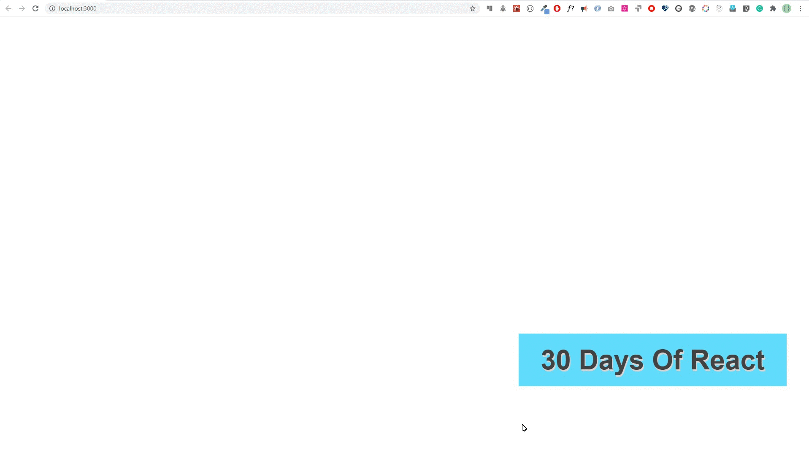

<div align="center">
  <h1> 30 Days Of React: Events</h1>
  <a class="header-badge" target="_blank" href="https://www.linkedin.com/in/asabeneh/">
  
  </a>
  <a class="header-badge" target="_blank" href="https://twitter.com/Asabeneh">
  
  </a>

<sub>Author:
<a href="https://www.linkedin.com/in/asabeneh/" target="_blank">Asabeneh Yetayeh</a><br>
<small> October, 2020</small>
</sub>

</div>

[<< Day 10](../10_React_Project_Folder_Structure/10_react_project_folder_structure.md) | [Day 12 >>](../12_Day_Forms/12_forms.md)


- [Events](#events)
  - [What is an event?](#what-is-an-event)
- [Exercises](#exercises)
  - [Exercises: Level 1](#exercises-level-1)
  - [Exercises: Level 2](#exercises-level-2)
  - [Exercises: Level 3](#exercises-level-3)

# Events


## What is an event?
Một sự kiện là một hành động hoặc sự kiện được nhận biết bởi một phần mềm. Để làm cho một sự kiện rõ ràng hơn, hãy sử dụng các hoạt động hàng ngày chúng ta thực hiện khi sử dụng máy tính chẳng hạn như nhấp vào nút, di chuột trên hình ảnh, nhấn phím, cuộn bánh xe chuột và các v.v. Trong phần này, chúng ta sẽ tập trung vào một số sự kiện chuột và bàn phím nhất định. Tài liệu React đã có một ghi chú chi tiết về [sự kiện](
https://reactjs.org/docs/handling-events.html).
Xử lý sự kiện trong React tương tự như xử lý các phần tử trên các phần tử DOM bằng JavaScript thuần túy. Một số khác biệt về cú pháp giữa việc xử lý sự kiện trong React và JavaScript thuần túy:

- Các sự kiện React được đặt tên bằng camelCase, thay vì chữ thường.
- Với JSX, bạn truyền một hàm làm trình xử lý sự kiện, thay vì một chuỗi.

Hãy xem một số ví dụ để hiểu về xử lý sự kiện.

Xử lý sự kiện trong HTML
```html
<!DOCTYPE html>
<html lang="en">
  <head>
    <meta charset="utf-8" />
    <title>30 Days Of React App</title>
  </head>
  <body>
    <button>onclick="greetPeople()">Greet People</button>
    <script>
      const greetPeople = () => {
        alert('Welcome to 30 Days Of React Challenge')
      }
    </script>
  </body>
</html>
```
Trong React, nó hơi khác một chút
```js
import React from 'react'
// if it is functional components
const App = () => {
  const greetPeople = () => {
    alert('Welcome to 30 Days Of React Challenge')
  }
  return <button onClick={greetPeople}> </button>
}
```


```js
import React, { Component } from 'react'
// if it is functional components
class App extends Component {
  greetPeople = () => {
    alert('Welcome to 30 Days Of React Challenge')
  }
  render() {
    return <button onClick={this.greetPeople}> </button>
  }
}
```
Another diferença entre HTML e React evento é que você não pode retornar `false` para impedir o comportamento padrão em React. Você deve chamar `preventDefault` explicitamente. Por exemplo, com HTML simples, para impedir o comportamento padrão do comportamento de link de abrir uma nova página, você pode escrever:

Plain HTML
```html
<a href="#" onclick="console.log('The link was clicked.'); return false">
  Click me
</a>
```
However, trong React có thể như sau:
```js
import React, { Component } from 'react'
// if it is functional components
class App extends Component {
  handleClick = () => {
    alert('Welcome to 30 Days Of React Challenge')
  }
  render() {
    return (
      <a href='#' onClick={this.handleClick}>
        Click me
      </a>
    )
  }
}
```
Xử lý sự kiện là một chủ đề rất rộng lớn và trong thử thách này chúng ta sẽ tập trung vào các loại sự kiện phổ biến nhất. Chúng ta có thể sử dụng các loại sự kiện chuột và bàn phím sau:
_onMouseMove, onMouseEnter, onMouseLeave, onMouseOut, onClick, onKeyDown, onKeyPress, onKeyUp, onCopy, onCut, onDrag, onChange, onBlur, onInput, onSubmit_

Hãy triển khai thêm một số sự kiện chuột và bàn phím.
```js
// index.js
import React, { Component } from 'react'
import ReactDOM from 'react-dom'

class App extends Component {
  state = {
    firstName: '',
    message: '',
    key: '',
  }
  handleClick = (e) => {
    // e gives an event object
    // check the value of e using console.log(e)
    this.setState({
      message: 'Welcome to the world of events',
    })
  }
  // triggered whenever the mouse moves
  handleMouseMove = (e) => {
    this.setState({ message: 'mouse is moving' })
  }
  // to get value when an input field changes a value
  handleChange = (e) => {
    this.setState({
      firstName: e.target.value,
      message: e.target.value,
    })
  }

  // to get keyboard key code when an input field is pressed
  // it works with input and textarea
  handleKeyPress = (e) => {
    this.setState({
      message:
        `${e.target.value} has been pressed and the keycode is` + e.charCode,
    })
  }
  // Blurring happens when a mouse leave an input field
  handleBlur = (e) => {
    this.setState({ message: 'Input field has been blurred' })
  }
  // This event triggers during a text copy
  handleCopy = (e) => {
    this.setState({
      message: 'Using 30 Days Of React for commercial purpose is not allowed',
    })
  }
  render() {
    return (
      <div>
        <h1>Welcome to the World of Events</h1>

        <button onClick={this.handleClick}>Click Me</button>
        <button onMouseMove={this.handleMouseMove}>Move mouse on me</button>
        <p onCopy={this.handleCopy}>
          Check copy right permission by copying this text
        </p>

        <p>{this.state.message}</p>
        <label htmlFor=''> Test for onKeyPress Event: </label>
        <input type='text' onKeyPress={this.handleKeyPress} />
        <br />

        <label htmlFor=''> Test for onBlur Event: </label>
        <input type='text' onBlur={this.handleBlur} />

        <form onSubmit={this.handleSubmit}>
          <div>
            <label htmlFor='firstName'>First Name: </label>
            <input
              onChange={this.handleChange}
              name='firstName'
              value={this.state.value}
            />
          </div>

          <div>
            <input type='submit' value='Submit' />
          </div>
        </form>
      </div>
    )
  }
}

const rootElement = document.getElementById('root')
// we render the JSX element using the ReactDOM package
ReactDOM.render(<App />, rootElement)
```


# Exercises

## Exercises: Level 1

1. What is an event?
2. What is the different between an HTML element event and React event?
3. Write at least 4 keyboard events?
4. Write at least 8 mouse events?
5. What are the most common mouse and keyboard events?
6. Write an event specific to input element?
7. Write an event specific to form element?
8. Display the coordinate of the view port when a mouse is moving on the body?
9. What is the difference between onInput, onChange and onBlur?
10. Where do we put the onSubmit event ?

## Exercises: Level 2

Implement the following using onMouseEnter event



## Exercises: Level 3

Coming

🎉 CONGRATULATIONS ! 🎉

[<< Day 10](../10_React_Project_Folder_Structure/10_react_project_folder_structure.md) | [Day 12 >>](../12_Day_Forms/12_forms.md)
