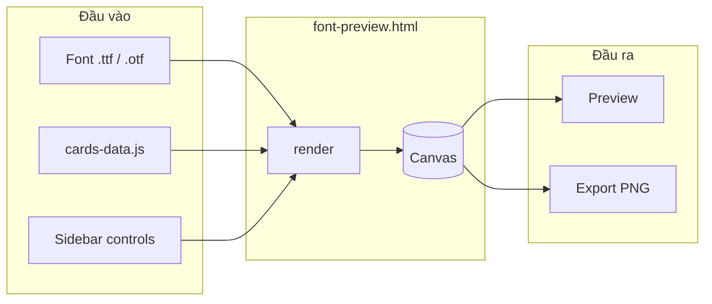

<!-- Claude / Anthropic-inspired documentation palette -->

<!-- canvas #faf9f5 · ink #141413 · coral #cc785c · surface card #efe9de · dark #181715 -->

  

<div align="center">

  

# FontForge Studio

  

**Công cụ preview & xuất ảnh type specimen — 100% trên trình duyệt, không backend.**

  

<p>

  

  

  

  

</p>

  

</div>

  

---

  

## Tổng quan

  

**ViewFont** (FontForge Studio) giúp bạn tải file font `.ttf` / `.otf`, xem trước trên nhiều khổ canvas, tùy chỉnh nền (màu, gradient, noise, card mẫu) và **xuất PNG** — phù hợp làm mockup MyFonts, portfolio, hoặc post mạng xã hội.

  

| Đặc điểm | Chi tiết |

|----------|----------|

| **Kiến trúc** | Một file HTML + JS, render bằng Canvas 2D API |

| **Backend** | Không có — mở trực tiếp `font-preview.html` hoặc double-click |

| **AI** | Không dùng AI trong app (badge *Preview Generator · No AI*) |

| **Offline** | Font UI + ảnh card nhúng sẵn; chỉ cần trình duyệt |

  



  

---

  

## Design system (tham chiếu Claude / Anthropic)

  

README này dùng **token palette** lấy cảm hứng từ [Anthropic Claude design language](https://www.anthropic.com): nền cream ấm, chữ ink đậm, accent coral tiết chế — tương phản với giao diện tối (#0a0a0b) bên trong app.

  

### Màu (documentation tokens)

  

| Token | Hex | Vai trò |

|-------|-----|---------|

| `canvas` | `#faf9f5` | Nền đọc chính (README, marketing) |

| `surface-card` | `#efe9de` | Khối nổi, bảng phụ |

| `surface-dark` | `#181715` | Badge, code block tối |

| `ink` | `#141413` | Tiêu đề, nhấn mạnh |

| `body` | `#3d3d3a` | Nội dung chính |

| `muted` | `#6c6a64` | Chú thích, meta |

| `primary` | `#cc785c` | CTA, link nhấn (coral) |

| `hairline` | `#e6dfd8` | Viền, divider |

  

### Typography (khuyến nghị khi mở rộng UI/docs)

  

| Cấp | Gợi ý | Ghi chú |

|-----|--------|---------|

| Display | Serif editorial (Copernicus / Georgia) | Tiêu đề hero |

| Body | Humanist sans (Styrene / system-ui) | Đoạn văn dài |

| UI / code | Monospace | Lệnh, đường dẫn file |

  

### App UI (trong `font-preview.html`)

  

App dùng theme **studio tối** riêng (không trùng cream canvas của Claude):

  

| Token app | Hex | Dùng cho |

|-----------|-----|----------|

| `--bg` | `#0a0a0b` | Nền trang |

| `--surface` | `#111113` | Sidebar, header |

| `--text` | `#f0ede8` | Chữ chính |

| `--accent` | `#e8d5a3` | Nút, logo mark |

  

---

  

## Cấu trúc dự án

  

```

ViewFont/

├── font-preview.html      # Ứng dụng chính (UI + logic render + export)

├── cards.js               # Danh sách card (file, label) — ~ vài KB

├── cards-data.js          # Ảnh card nhúng base64 — ~24 MB (auto-generated)

├── card_js.py             # Script build cards.js + cards-data.js

├── fonts/

│   ├── DMSerifDisplay-Regular.ttf   # Font mặc định preview (canvas-safe)

│   └── DMMono-Regular.ttf           # Subtitle, watermark

├── CardImg/               # Nguồn ảnh gốc (77 mẫu .jpg)

└── README.md

```

  

> **Lưu ý:** `cards-data.js` rất nặng vì nhúng toàn bộ ảnh để **export PNG hoạt động khi mở `file://`** (trình duyệt không cho đọc thư mục `CardImg/` tự động). Đây là trade-off cố ý: không server, không bước “link folder”.

  

---

  

## Yêu cầu

  

| Thành phần | Phiên bản / ghi chú |

|------------|---------------------|

| Trình duyệt | Chrome, Edge, hoặc Firefox (mới) |

| Python | 3.x — **chỉ khi** thêm/xóa ảnh trong `CardImg/` và chạy `card_js.py` |

| Mạng | Không bắt buộc sau khi đã có `fonts/` và `cards-data.js` |

  

---

  

## Bắt đầu nhanh

  

### 1. Mở ứng dụng

  

```powershell

# Cách đơn giản nhất — không cần terminal

# Double-click file:

font-preview.html

```

  

Hoặc kéo `font-preview.html` vào Chrome / Edge.

  

### 2. Tải font

  

1. Khu vực **Font File** → click hoặc **kéo thả** file `.ttf` / `.otf` / `.woff` / `.woff2`

2. Tên font hiện trên sidebar; preview canvas cập nhật ngay

3. Nút **✕** để gỡ font

  

### 3. Chỉnh preview & xuất

  

1. Chọn **Canvas Template**, **Background**, text, decoration

2. **Export PNG** → file `{tên-font}-preview.png`

  

---

  

## Tính năng chi tiết

  

### Canvas templates

  

| Template | Kích thước | Use case gợi ý |

|----------|------------|----------------|

| Poster | 800 × 600 | Preview ngang, marketplace |

| Square | 600 × 600 | Instagram, avatar promo |

| Banner | 900 × 400 | Header web, cover |

| Story | 540 × 960 | Story / Reels dọc |

| Wide | 1200 × 500 | Hero rộng |

  

Thanh toolbar: zoom **− / + / ⊡ Fit** và hiển thị kích thước pixel thực.

  

### Background

  

| Kiểu | Mô tả |

|------|--------|

| **Solid** | Một màu nền (`BG Color 1`) |

| **Gradient vertical** | Chuyển màu dọc (Color 1 → 2) |

| **Gradient radial** | Tỏa từ giữa |

| **Dark noise** | Nền tối + hạt noise ngẫu nhiên |

| **Ruled lines** | Nền + đường kẻ ngang |

| **Card image** | 77 ảnh mẫu từ thư viện card |

  

Với **Card image**: bấm **Select a card image…** → chọn trong modal → **Apply**.

  

### Main & sub text

  

- **Main text**: nội dung chính, cỡ chữ, letter-spacing, màu, opacity, vị trí Y, căn trái/giữa/phải

- **Sub text**: dòng phụ (uppercase), cỡ và màu riêng

- Font chính = font bạn upload; chưa upload thì dùng **DM Serif Display** (local)

  

### Decoration

  

| Tùy chọn | Hiệu ứng |

|----------|----------|

| **Border** | Viền trong canvas |

| **H-Line** | Gạch ngang dưới main text |

| **Grid** | Lưới mờ accent |

| **Accent color** | Màu cho border / line / grid / watermark |

  

### Export PNG

  

- Nút **↓ Export PNG** ở cuối sidebar

- Dùng `canvas.toBlob('image/png')` — cần canvas **không bị tainted**

- Font UI load từ `fonts/` (local), không qua Google Fonts CDN

- Ảnh card load từ `CARD_DATA_URLS` trong `cards-data.js` (data URL same-origin)

  

**Kéo thả font** toàn cửa sổ khi thả file font (overlay drop zone).

  

---

  

## Quản lý thư viện card

  

### Thêm / đổi ảnh mẫu

  

1. Copy ảnh vào `CardImg/` (`.jpg`, `.png`, `.webp`, `.svg`)

2. Chạy build:

  

```powershell

cd d:\DeskTop\IT\Tool\ViewFont

python card_js.py

```

  

3. Script tạo lại:

   - `cards.js` — manifest `{ file, label }`

   - `cards-data.js` — map `filename → data:image/...;base64,...`

4. Refresh `font-preview.html` (F5)

  

### Vì sao cần `cards-data.js`?

  

| Cách load | Preview | Export PNG (`file://`) |

|-----------|---------|-------------------------|

| `CardImg/photo.jpg` (đường dẫn) | ✅ | ❌ Canvas tainted |

| `CARD_DATA_URLS` (base64 nhúng) | ✅ | ✅ |

  

Trình duyệt **cấm** JavaScript đọc folder trên ổ đĩa khi mở file HTML trực tiếp — dù ảnh đã nằm cạnh project. Nhúng base64 lúc build = “link sẵn” ảnh mẫu vào app.

  

---

  

## Luồng kỹ thuật

  

### Load font

  

```text

FileReader (ArrayBuffer)

    → FontFace("CustomFont", buffer)

    → document.fonts.add()

    → render() với ctx.font = "CustomFont"

```

  

### Render pipeline

  

```text

clearRect

  → vẽ background (solid / gradient / noise / lines / card)

  → decoration (grid, border)

  → main text (+ letter-spacing từng ký tự nếu ≠ 0)

  → H-line (optional)

  → sub text (DM Mono local)

  → watermark (tên font + "FONTFORGE STUDIO")

```

  

### Scripts phụ thuộc

  

```html

<script src="cards.js"></script>       <!-- CARD_FILES -->

<script src="cards-data.js"></script>  <!-- CARD_DATA_URLS -->

```

  

Thứ tự bắt buộc: `cards.js` trước, `cards-data.js` sau, rồi inline script trong HTML.

  

---

  

## Xử lý sự cố

  

<details>

<summary><strong>Export PNG bị lỗi / không tải file</strong></summary>

  

- Đảm bảo có file `cards-data.js` (chạy `python card_js.py` nếu thiếu)

- Với nền **Card image**: phải **Apply** card trước khi export

- Thử trình duyệt khác nếu extension chặn download

- Mở DevTools (F12) → Console xem lỗi `SecurityError` (canvas tainted)

  

</details>

  

<details>

<summary><strong>Trang load chậm lần đầu</strong></summary>

  

- `cards-data.js` ~24 MB — parse một lần, sau đó cache trình duyệt

- Không cố “tối ưu” bằng cách bỏ file này nếu cần export card offline

  

</details>

  

<details>

<summary><strong>Card không hiện trong modal</strong></summary>

  

- Kiểm tra `cards.js` và `cards-data.js` cùng thư mục với `font-preview.html`

- Chạy lại `card_js.py` sau khi đổi `CardImg/`

  

</details>

  

<details>

<summary><strong>Font upload không áp dụng</strong></summary>

  

- Chỉ hỗ trợ `.ttf`, `.otf`, `.woff`, `.woff2`

- File corrupt hoặc font bị license embed restriction có thể fail `FontFace.load()`

  

</details>

  

---

  

## Giới hạn đã biết

  

- **Không** chỉnh sửa vector text sau export — output là raster PNG

- **Noise** background: hạt random mỗi lần `render()` (không cố định seed)

- **Một** font custom tại một thời điểm

- `cards-data.js` lớn — không phù hợp commit lên repo nhỏ nếu dùng Git LFS; có thể `.gitignore` và build local

  

---

  

## Font & license

  

| File | Nguồn | License |

|------|--------|---------|

| DM Serif Display | [Google Fonts](https://fonts.google.com/specimen/DM+Serif+Display) | [OFL](https://scripts.sil.org/OFL) |

| DM Mono | [Google Fonts](https://fonts.google.com/specimen/DM+Mono) | [OFL](https://scripts.sil.org/OFL) |

  

Ảnh trong `CardImg/` — dùng cho mục đích demo/preview trong dự án; kiểm tra quyền sử dụng nếu phân phối lại bộ ảnh.

  

---

  

## Roadmap gợi ý (chưa có trong bản hiện tại)

  

- [ ] Export JPG / WebP với chất lượng tùy chọn

- [ ] Seed cố định cho noise background

- [ ] Nhiều weight font (bold / italic) khi file font hỗ trợ

- [ ] Preset lưu cấu hình (JSON localStorage)

- [ ] Theme sáng theo token Claude (`#faf9f5` canvas) trong app

  

---

  

## Tóm tắt một dòng

  

> Mở `font-preview.html` → kéo font vào → chỉnh layout → Export PNG. Không server. Card & export: nhớ `python card_js.py` khi đổi ảnh trong `CardImg/`.

  

---

  

<div align="center">

  

<sub>Documentation palette: Anthropic Claude-inspired · App UI: FontForge dark studio</sub>

  

**ViewFont** · FontForge Studio · Preview Generator · No AI

  

</div>